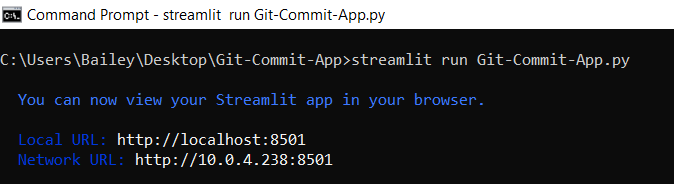
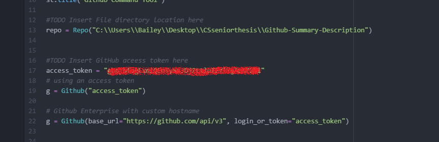
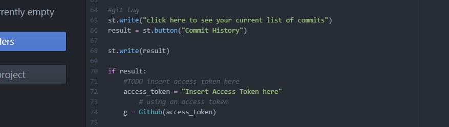
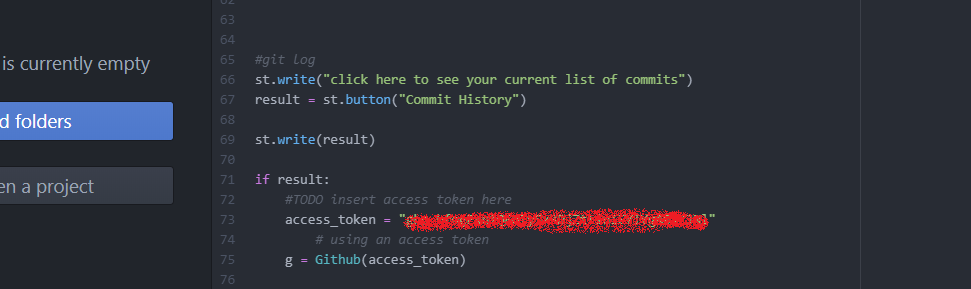
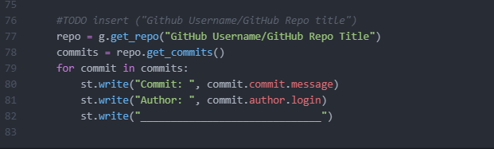
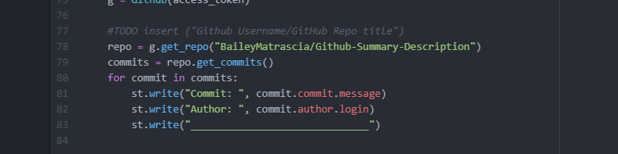

# Git-Commit-App
Streamlit App to help first time GitHub users to create commits 

## Requirements

Git
Streamlit
Python

## How to run
1. In order to run Git Commit App, the user must first download the repository locally. 

2. Then the user must set up the app for their project repository they intend to use Git Commit App on. 

3. Lastly, the user must run the command 'streamlit run Git-Commit-App.py' in the terminal in the Git-Commit-App repository which will open the app in the user's web browser. 

4. After, the app is running and ready for commits!

## Set up

1. First on line 13 in the Git-Commit-App the user needs to input the directory location of the GitHub project they intend on creating commits for.
A helpful hint- copy and paste the directory by right click up here and paste it directly in the code. 

2. Then on line 17 and line 72, the user must input an access token for their repostiory so that the app can access the repository. Instructions on how to create a personal access token can be found here https://docs.github.com/en/authentication/keeping-your-account-and-data-secure/creating-a-personal-access-token
In short the user will click on their repository settings and then on the left sidebar select "developer settings" and then click on "personal access tokens" and go from there. (WARNING: this token can give ANYONE access to edit and have control over your respository. Make sure to not share it with anyone and set an expiration date.) 

3. Lastly, on line 77, the user must input their GitHub username and their GitHub Repository name.

4. Once all of the steps are complete, the app is good to go!

